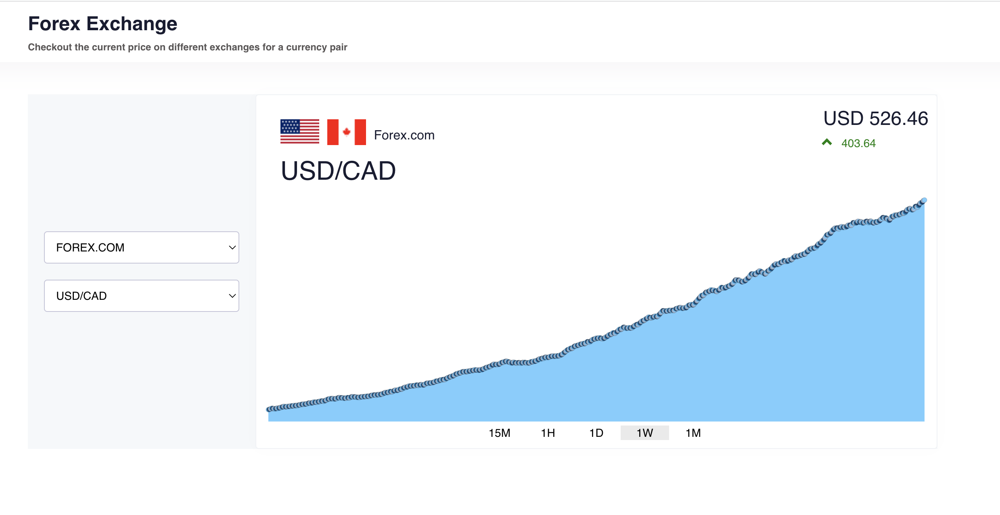

# Forex Exchange App
Responsive web application which shows the historical and current rate for an FX pair developed with Vue3.


[]()
[]()


## Project Overview

**Project Demo Link**
https://forex-exchange.vercel.app/

**Screenshots :**




## Project setup
```
yarn install
```

### Compiles and hot-reloads for development
```
yarn serve
```

### Compiles and minifies for production
```
yarn build
```

### Lints and fixes files
```
yarn lint
```


## Meta

Created and maintained by [Alperen](https://github.com/iamalperen) under [MIT](LICENSE.md) License
